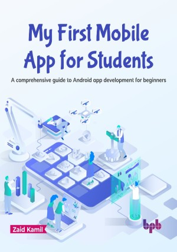

# My First Mobile App for Students

Learn the basics of Kotlin and build your first Android app

This is the repository for [My First Mobile App for Students
](https://bpbonline.com/products/my-first-mobile-app-for-students?variant=42893775503560),published by BPB Publications.

## About the Book
In the digital age, mobile apps are the primary way for businesses and individuals to connect with their audience. Android is the leading platform, with a 71% market share worldwide and over 2.87 billion apps.  If you are an aspiring app developer, this book is the perfect place to start.

The book focuses on hands-on learning, taking you through the process of transforming your ideas into reality. Starting with the basics, you will learn how to set up Android Studio and master Kotlin fundamentals. You will then build on the Android Jetpack library to create a strong architectural foundation for your apps. Along the way, you will create six fully-functional apps, complete with UI and coding logic, all powered by Kotlin.

By the end of this book, you will have the skills and knowledge you need to create innovative apps and thrive in the dynamic app development landscape.

## What You Will Learn
•  Build functional Android apps with UI and coding proficiency.

•  LMaster Kotlin's syntax and replace Java for app development.

•  Implement UI elements, event handling, data passing, and animations.

•  Build apps using Android Jetpack architecture and modern tools.

•  Leverage coroutines to integrate web services and Retrofit libraries.

•  Design apps with data persistence, SQL, Room Framework, and Firebase.
